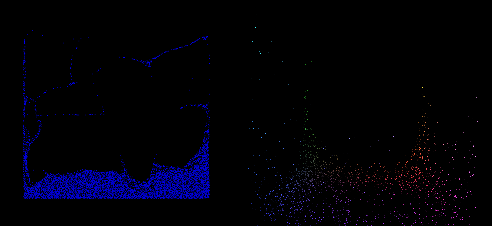

# Material Point Method with OpenCL



This project implements both MPM 2D and 3D simple solvers in OpenCL, with SFML
and OpenGL showing the simulation results. 

## Project Structure
This project heavily depends on CMake. There are two targets `mpm-opencl-2d` and `mpm-opencl-3d` representing the 2D and 3D version of the MPM method respectively.

Source codes locate under the `/src/` path.

This project depends on the **OpenCL SDK** project, which explicitly depends on **OpenCL**, **OpenCL-CLHPP**, **OpenCL-Headers**, and **OpenCL-ICD-Loader** projects.
These projects are included as git submodules. So please use `git clone --recursive` command to clone this project, or `git submodule init && git submodule update` to fetch these submodules later.

## Build Instructions
This project includes 2D and 3D versions of MPM implementation. You can find the corresponding CMake target
**mpm-opencl-2d** and **mpm-opencl-3d** respectively.

To build this project, you can simply
```bash
mkdir build
cd build
cmake ..
make mpm-opencl-2d
make mpm-opencl-3d
```

## Acknowledgement, License, and Copyright
Licensed under Apache-2.0 License. This project uses OpenCL-SDK as a codebase, especially the OpenGL & OpenCL interoperation feature demonstrated in N-Body sample. OpenCL-SDK project is licensed under Apache-2.0.

The MLS-MPM simulation codes follow the routine provided by relevant Python examples from [Taichi](https://github.com/taichi-dev/taichi) along with the instructions provided in the course GAMES 201 by Yuanming Hu. Taichi is also licensed under Apache-2.0.
